# OffWay

> **연차로 떠나는 로컬 여행 플래너**

국내 여행 수요의 과도한 쏠림으로 주요 도시는 오버투어리즘을 겪는 반면, 행정안전부가 지정한 89개 인구감소지역은 생활인구 유입이 절실한 상황입니다.

이에 정부와 지자체가 숙박세일페스타, 디지털관광주민증, KTX·SRT 할인 등 다양한 지원책을 마련했으나, 정보가 각 부처와 지자체에 파편화되어 있어 여행자에게 실질적으로 닿지 못하고 있습니다.

OffWay는 여행자의 남은 연차에 맞춰 89개 지역의 최적 이동 코스를 자동으로 완성하고, 해당 여정에서 누릴 수 있는 교통·숙박 지원 혜택을 빠짐없이 연결해 여행자의 비용 부담을 낮추고 지역 경제 활성화를 이끕니다.

## 목차

1. [서비스 소개](#서비스-소개)
2. [주요 기능](#주요-기능)
3. [기술 스택](#기술-스택)
4. [데이터 풀](#데이터-풀)
5. [도메인 구성](#도메인-구성)
6. [시스템 아키텍처](#시스템-아키텍처)
7. [코스 생성 흐름](#코스-생성-흐름)
8. [배포 자동화](#배포-자동화)
9. [백오피스](#백오피스)
10. [서비스 발전 계획](#서비스-발전-계획)
11. [팀 소개](#팀-소개)

## 서비스 소개

**여행지를 고르는 기준을 바꿨습니다.**

대부분의 여행 서비스가 '어디로 갈지'를 먼저 정한다면, OffWay 는 '이번 여행에 연차를 얼마나 쓸 수 있는지'부터 파악합니다.

남은 연차와 이동수단, 여행 스타일에 맞춰 실제로 다녀올 수 있는 지역과 코스를 추천합니다.

**여행 전후의 연차까지 함께 관리합니다.**

남은 연차를 기록하고 황금연휴처럼 연차를 쓰기 좋은 시기를 알려줍니다.

여행을 다녀온 뒤에는 사용한 연차를 반영해, 다음 여행을 계획할 때 다시 활용할 수 있습니다.

**89개 인구감소지역을 중심으로 소개합니다.**

익숙한 인기 관광지보다 행정안전부가 지정한 인구감소지역 89곳을 중심으로 새로운 여행지를 제안합니다.

지역별 관광정보와 흩어져 있던 정부·지자체의 여행 혜택도 한곳에서 확인할 수 있습니다.

## 주요 기능

### 1 · 연차 기반 맞춤 여행 코스 추천

남은 연차와 이동수단, 여행 스타일을 바탕으로 인구감소지역과 맞춤 여행 코스를 추천합니다.

<table>
  <tr>
    <td align="center" width="25%">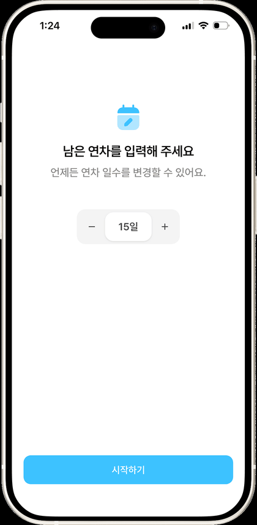</td>
    <td align="center" width="25%">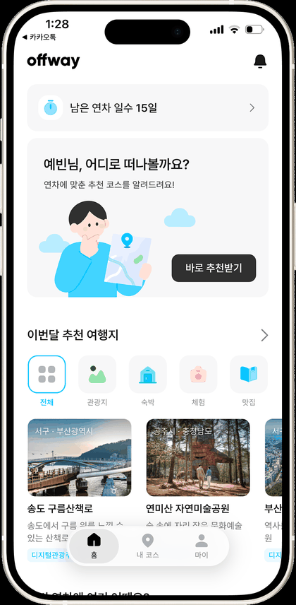</td>
    <td align="center" width="25%">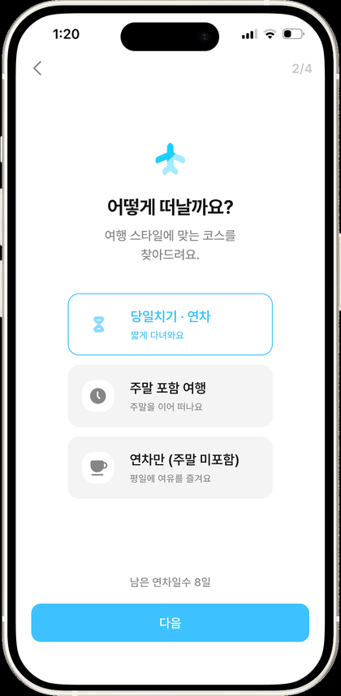</td>
    <td align="center" width="25%">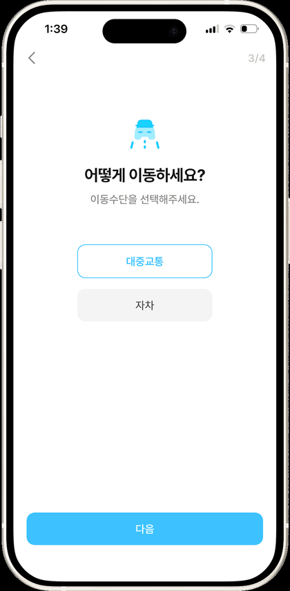</td>
  </tr>
  <tr>
    <td align="center">① 온보딩 화면에서<br>사용자의 남은 연차<br>일수를 입력합니다.</td>
    <td align="center">② 홈 화면에서 남은<br>연차를 확인하고 맞춤<br>여행 코스 추천을<br>시작합니다.</td>
    <td align="center">③ 당일치기·주말<br>포함·연차 등 여행에<br>사용할 연차 방식을<br>선택합니다.</td>
    <td align="center">④ 대중교통 또는 자차<br>등 여행에 이용할<br>이동수단을<br>선택합니다.</td>
  </tr>
</table>

### 2 · 조건에 맞는 지역·코스 추천

입력한 여행 조건을 바탕으로 맞춤 코스를 추천하고, 마음에 드는 코스를 저장합니다.

<table>
  <tr>
    <td align="center" width="25%"></td>
    <td align="center" width="25%">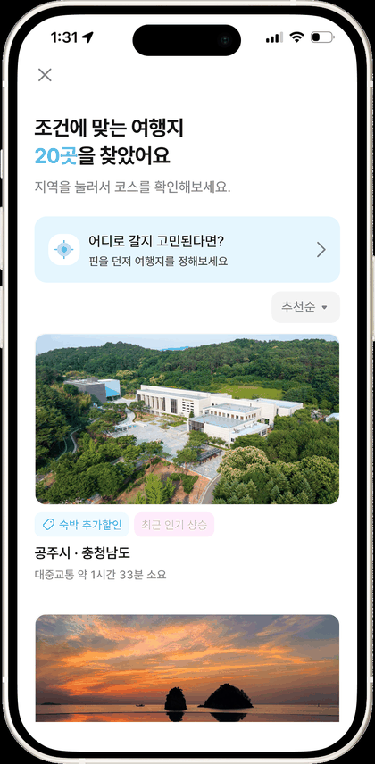</td>
    <td align="center" width="25%">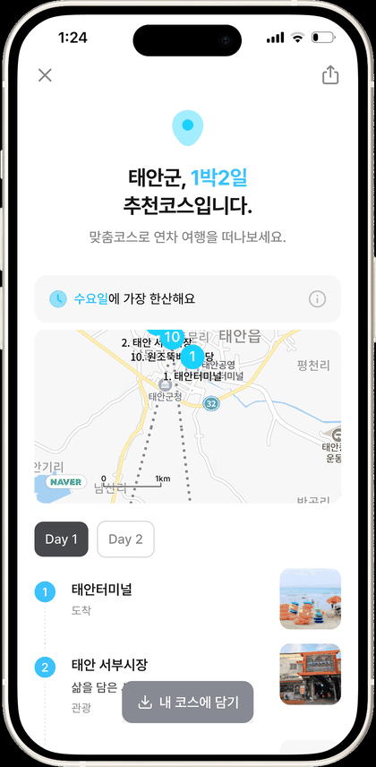</td>
    <td align="center" width="25%">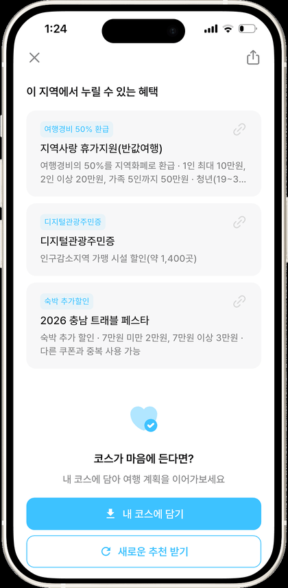</td>
  </tr>
  <tr>
    <td align="center">① 입력한 연차와 여행<br>조건을 바탕으로 여행<br>가능한 지역을<br>탐색합니다.</td>
    <td align="center">② 조건에 맞는<br>인구감소지역을<br>추천하고 원하는<br>지역을 선택합니다.</td>
    <td align="center">③ 선택한 지역의 여행<br>기간과 스타일에 맞춰<br>날짜별 코스를<br>추천합니다.</td>
    <td align="center">④ 받을 수 있는 여행<br>혜택을 확인하고,<br>마음에 드는 코스를<br>저장합니다.</td>
  </tr>
</table>

### 3 · 저장한 여행 관리·상세 정보 확인

저장한 코스의 일정과 이동 정보를 확인하고, 코스에 포함된 장소의 상세 관광정보를 확인합니다.

<table>
  <tr>
    <td align="center" width="25%">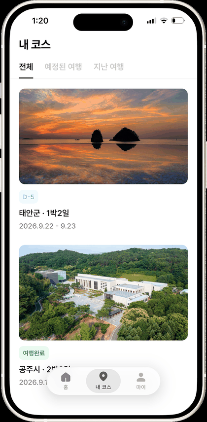</td>
    <td align="center" width="25%">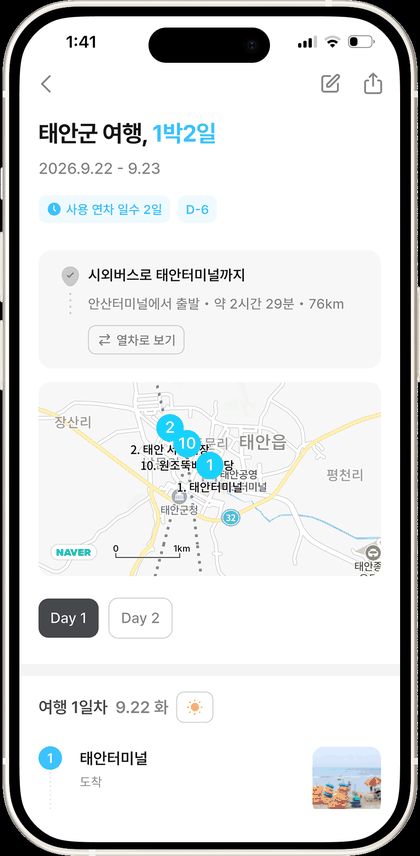</td>
    <td align="center" width="25%">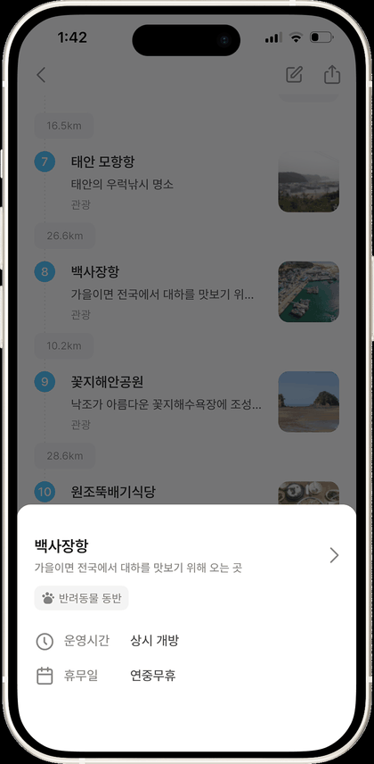</td>
    <td align="center" width="25%">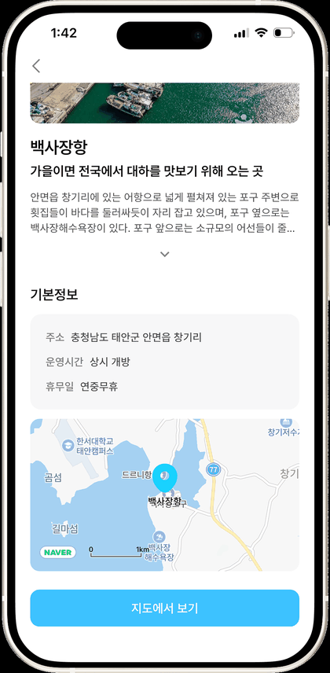</td>
  </tr>
  <tr>
    <td align="center">① '내 코스' 탭에서<br>예정된 여행과 지난<br>여행을 한눈에<br>확인합니다.</td>
    <td align="center">② 저장한 코스의 이동<br>정보와 날씨, 날짜별<br>여행 일정을<br>확인합니다.</td>
    <td align="center">③ 장소를 선택해<br>운영시간·휴무일 등<br>필요한 정보를 빠르게<br>확인합니다.</td>
    <td align="center">④ 장소의 소개,<br>기본정보, 위치 등<br>상세 관광정보를<br>확인합니다.</td>
  </tr>
</table>

### 4 · 연차 사용 기록 및 관리

여행 후 사용한 연차를 반영하고, 직접 사용 내역을 등록해 남은 연차를 관리합니다.

<table>
  <tr>
    <td align="center" width="25%">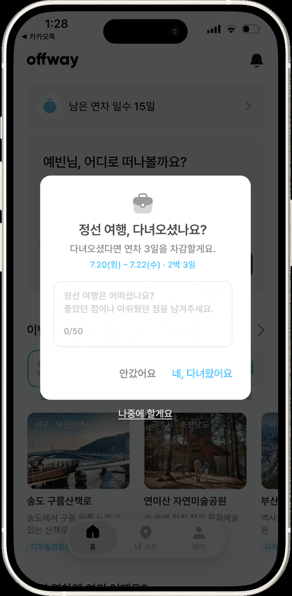</td>
    <td align="center" width="25%">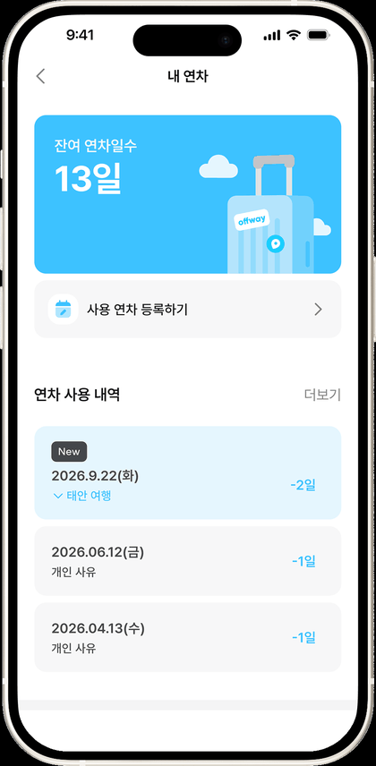</td>
    <td align="center" width="25%">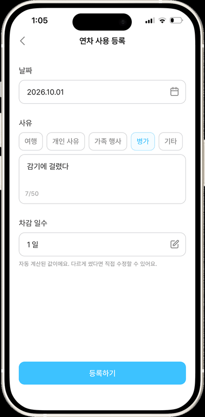</td>
    <td align="center" width="25%">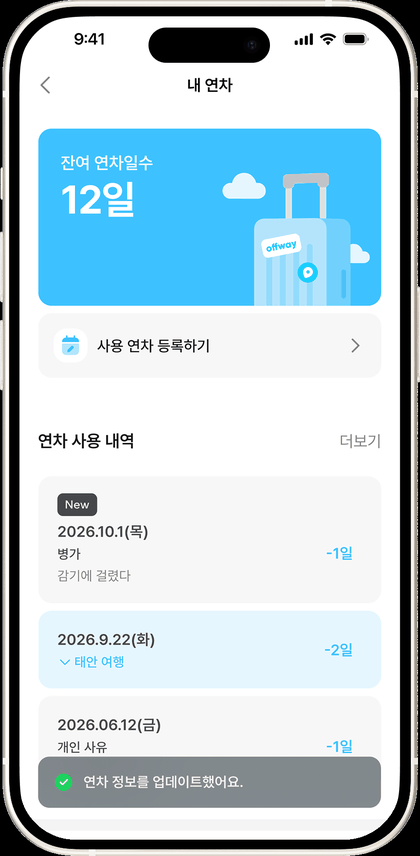</td>
  </tr>
  <tr>
    <td align="center">① 여행이 끝난 후<br>실제 방문 여부를<br>확인하고 사용한<br>연차를 반영합니다.</td>
    <td align="center">② 남은 연차와<br>지금까지 사용한 연차<br>내역을 한눈에<br>확인합니다.</td>
    <td align="center">③ 여행 외에 사용한<br>연차도 날짜와 사유를<br>입력해 직접<br>등록합니다.</td>
    <td align="center">④ 등록한 내역을<br>반영해 남은 연차<br>일수를 자동으로<br>업데이트합니다.</td>
  </tr>
</table>

### 5 · 여행 정보 탐색 및 일정 알림

관광정보와 여행 혜택을 확인하고 위젯과 다이나믹 아일랜드를 통해 일정을 간편하게 확인합니다.

<table>
  <tr>
    <td align="center" width="25%">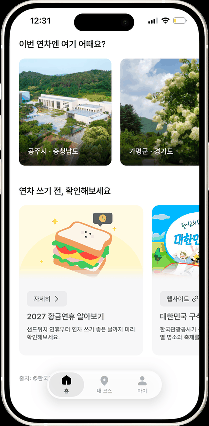</td>
    <td align="center" width="25%">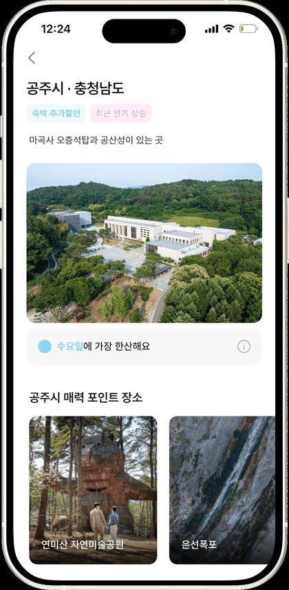</td>
    <td align="center" width="25%">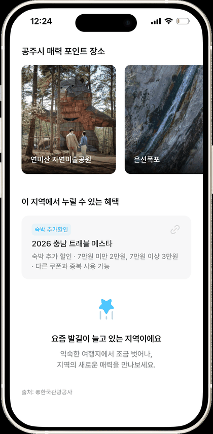</td>
    <td align="center" width="25%">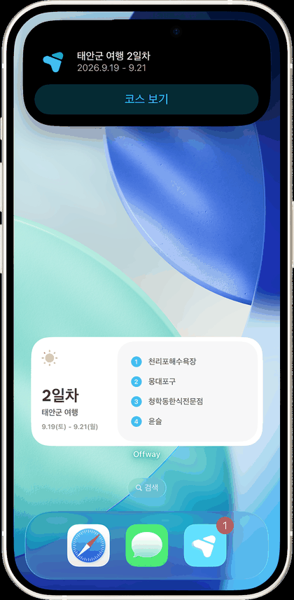</td>
  </tr>
  <tr>
    <td align="center">① 홈에서<br>정부·지자체의 여행<br>정책과 혜택을 한눈에<br>확인할 수 있습니다.</td>
    <td align="center">② 지역의 주요 관광지<br>설명과 방문 정보를<br>확인합니다.</td>
    <td align="center">③ 관광지와 함께<br>지역에서 받을 수 있는<br>여행 혜택을<br>확인합니다.</td>
    <td align="center">④ 위젯과 다이나믹<br>아일랜드에서 남은<br>D-day와 일정을 바로<br>확인합니다.</td>
  </tr>
</table>

## 기술 스택

**Language & Framework**

<p>
  
  
  
  
</p>

**Database**

<p>
  
  
  
  
</p>

**Infra & Deploy**

<p>
  
  
  
  
  
</p>

**API & 알림**

<p>
  
  
  
  
</p>

**Test**

<p>
  
  
</p>

## 데이터 풀

89곳 전부의 장소를 미리 확보해 두었습니다.

| 종류 | 건수 | 출처 |
|---|---|---|
| 맛집 | **75,565** | 지방행정인허가 |
| 숙소 | **26,365** | 숙박업 · 농어촌민박 · 한옥체험 · 관광펜션 |
| 카페 | **15,619** | 휴게음식점 |
| 관광명소 | **3,844** | 전통사찰 · 박물관/미술관 · 테마파크 · 휴양시설 |
| 국가유산 | **3,437** | 국가유산청 |
| 야영장 | **1,698** | 고캠핑(한국관광공사) |
| 축제 | **345** | 전국문화축제표준데이터 |
| **합계** | **126,873** | 지역 커버 **89/89** |

> 상세는 [장소 풀 상세](docs/data-pool.md).

### 한국관광공사 OpenAPI

| API | 쓰임 |
|---|---|
| 국문 관광정보 서비스 | 여행지 · 식당 · 카페 · 숙소의 기본 정보와 운영시간 · 휴무일 |
| 무장애 여행 정보 | 휠체어 이동 동선, 점자 안내, 전용 주차장 등 편의시설 |
| 빅데이터 지역별 방문자수 | 지역별 · 일자별 방문자 수와 요일별 방문 패턴 |
| 기초지자체 중심 관광지 정보 | 지역별 실제 방문 빈도가 높은 핵심 명소 |
| 관광지별 연관 관광지 정보 | 선행 여행지와 함께 방문한 연관 관광지 |
| 관광사진 정보 | 지역 대표 사진과 기차역 · 터미널 고화질 이미지 |
| 고캠핑 정보 조회서비스 | 전국 야영장 · 캠핑장의 위치와 시설 이미지 |
| 반려동물 동반여행 서비스 | 반려동물 출입 가능 여부와 입장 구역 · 허용 체중 |
| 관광지 집중률 방문자 추이 예측 | 향후 30일간 관광지별 혼잡도 예측 |

### 그 밖의 API · 파일데이터

| 출처 | 쓰임 |
|---|---|
| 기상청 단기예보 `VilageFcstInfoService_2.0` | 여행 일자의 기온 · 강수확률 · 하늘 상태 |
| 기상청 중기예보 `MidFcstInfoService` | 단기예보 범위를 벗어나는 일정의 날씨 · 기온 전망 |
| 한국천문연구원 특일정보 `SpcdeInfoService` | 법정 공휴일과 대체공휴일 |
| 국토교통부 TAGO 열차 `TrainInfo` | 열차 노선과 시간표 |
| 국토교통부 TAGO 고속버스 `ExpBusInfo` | 고속버스 터미널과 운행 편 · 소요시간 |
| 국토교통부 TAGO 시외버스 `SuburbsBusInfo` | 시외버스 터미널과 구간 소요시간 |
| 국토교통부 TAGO 국내선박운항 `DmstcShipNvgInfo` | 연안 여객선 항구와 항로별 운항 편 |
| SK TMAP 경유지 최적화 `routeOptimization10` | 하루 일정의 최적 방문 순서 |
| SK TMAP 경로 `tmap/routes` | 장소 사이 실제 도로 주행 거리와 이동 시간 |
| 카카오 로컬 검색 | 출발지로 입력한 주소 · 키워드를 좌표로 변환 |
| 국가유산청 국가유산 검색 `SearchKindOpenapi` | 국보 · 보물 · 사적 · 천연기념물의 좌표 · 사진 · 설명 |
| 네이버 클라우드 플랫폼 Geocoding | 국가유산 원본에 비어 있는 좌표 보정 |
| 지방행정 인허가 데이터 <sup>파일</sup> | 음식점 · 카페 · 숙박업의 영업 상태 · 주소 · 전화 |
| 전국문화축제표준데이터 <sup>파일</sup> | 지역 축제의 개최 기간 · 장소 · 좌표 |
| 대한민국 구석구석 캐치프레이즈 <sup>파일</sup> | 관광지 한 줄 소개 45,149건 |
| 시도 행정구역 경계 <sup>파일</sup> | 역 · 터미널 · 항구 904곳이 속한 시도 판정 |

## 도메인 구성

`package-by-feature` 로 나눕니다.

모든 도메인이 같은 층을 갖습니다.

아래는 가장 두꺼운 `trip` 만 끝까지 펼친 모습입니다.

```
📦 com.offway.core
 ┃
 ┣ 📂 trip ─────────────── 인구감소지역 · 장소 풀 · 관광지 추천
 ┃  ┣ 📂 controller ────── HTTP 진입
 ┃  ┃  ┗ 📂 dto ────────── API 계약
 ┃  ┣ 📂 service ───────── 유스케이스 조율 · 트랜잭션 경계
 ┃  ┃  ┗ 📂 dto ────────── 내부 command · result
 ┃  ┣ 📂 domain ────────── 엔티티 · 값객체 · enum · 예외
 ┃  ┣ 📂 repository ────── port + adapter
 ┃  ┗ 📂 infrastructure ── 외부 API 어댑터
 ┃     ┣ 📂 tour ───────── TourAPI
 ┃     ┣ 📂 datalab ────── 관광빅데이터
 ┃     ┣ 📂 localdata ──── 지방행정인허가
 ┃     ┣ 📂 camping ────── 고캠핑
 ┃     ┣ 📂 festival ───── 축제표준데이터
 ┃     ┣ 📂 gallery ────── 관광사진갤러리
 ┃     ┣ 📂 crowd ──────── 관광지 집중률
 ┃     ┗ 📂 pet ────────── 반려동물 동반여행
 ┃
 ┣ 📂 leave ────────────── 연차 · 가용시간 · 샌드위치 연휴
 ┣ 📂 transport ────────── 교통 · 동선 · 출발지 검색
 ┣ 📂 itinerary ────────── 코스 생성
 ┣ 📂 region ───────────── 인구감소지역 89곳 마스터 · 태그
 ┣ 📂 weather ──────────── 날씨 · 관광기후지수
 ┣ 📂 policy ───────────── 여행 혜택 매칭
 ┣ 📂 curation ─────────── 지역 큐레이션 링크
 ┣ 📂 inventory ────────── 장소 재고 · 적재
 ┃
 ┣ 📂 user ─────────────── 사용자 · 소셜 로그인
 ┣ 📂 device ───────────── 디바이스 토큰
 ┣ 📂 notification ─────── 푸시 알림
 ┣ 📂 liveactivity ─────── 잠금화면 실시간 카드
 ┃
 ┗ 📂 common ───────────── 응답 래퍼 · 예외 · 캐시 · 설정
```

의존 방향은 `controller → service → domain` 입니다.

`repository` 와 `infrastructure` 가 `domain` 의 port 를 구현합니다.

외부 API 는 소유 도메인의 `infrastructure/` 에만 둡니다.

| 도메인 | 소유 외부 API |
|---|---|
| `leave` | 특일정보 |
| `transport` | TMAP · TAGO · Kakao |
| `weather` | 기상청 |
| `user` · `liveactivity` | Kakao · Apple · APNs |

다른 도메인이 그 API 가 필요하면 소유 도메인의 service 를 거칩니다.

`itinerary` · `leave` · `user` · `notification` · `liveactivity` 에는 `event` 층이 하나 더 있습니다.

## 시스템 아키텍처

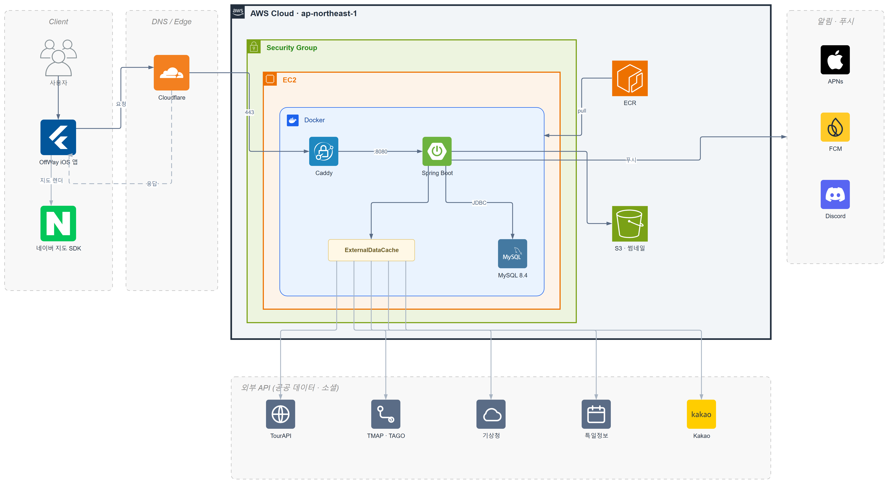

## 코스 생성 흐름

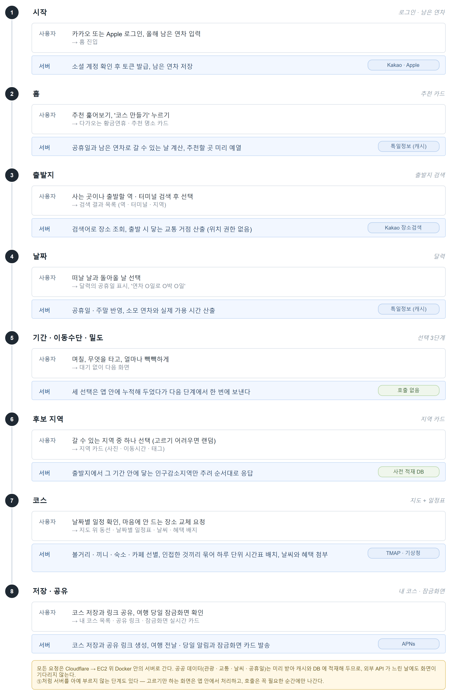

## 배포 자동화

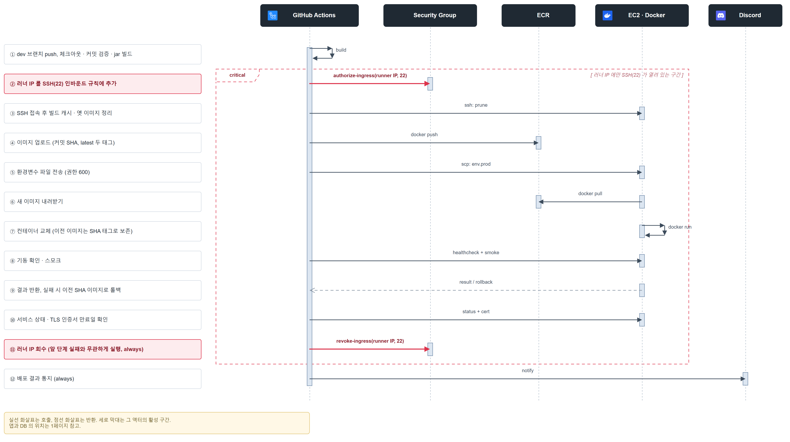

배포하는 동안에만 러너 IP 를 인바운드 규칙에 넣었다가 회수하는, 일회성 포트 개방으로 보안 그룹을 제어합니다.

## 백오피스

흩어져 있는 정책과 혜택을 앱 안으로 끌어오는 화면입니다.

서버가 정적 SPA 로 함께 서빙하고, `ROLE_ADMIN` 뒤에 둡니다.

### 바로가기 링크

정책과 혜택을 카드로 만들어 앱 화면에 붙입니다. 누르면 신청 페이지로 바로 넘어가, 사용자가 부처 사이트를 헤매지 않습니다.

홈 · 지역 · 코스 · 장소 네 화면 중 어디에 띄울지 고르고, 끌어서 순서를 바꾸면 그 자리에서 저장됩니다.

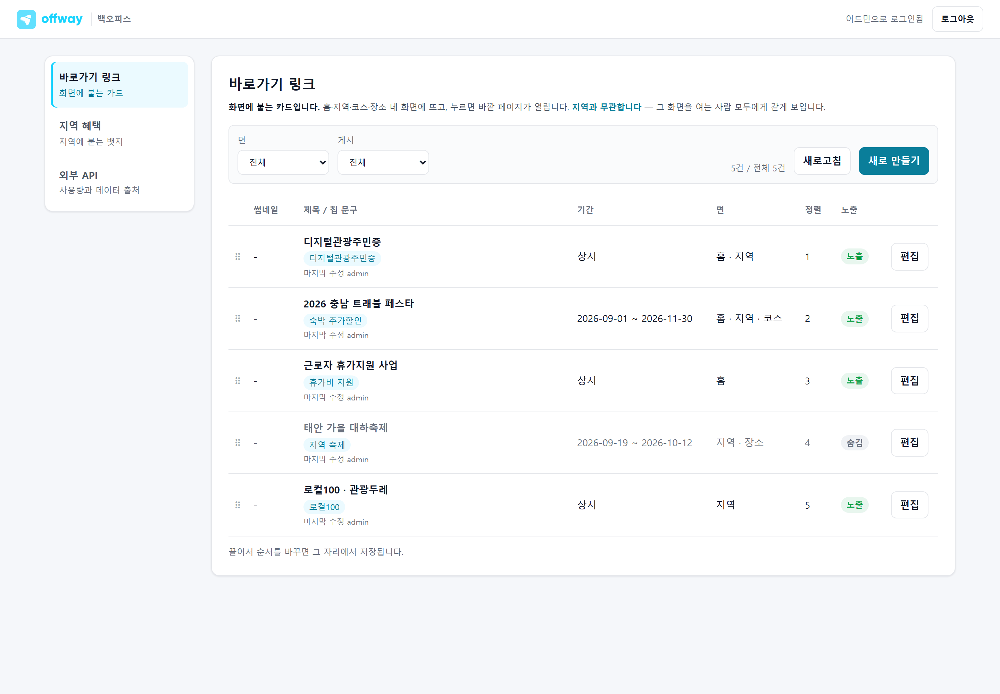

### 지역 혜택

혜택은 분류마다 대상 지역이 정해져 있습니다. 여행지의 지역 코드가 거기 들어가면 **코스 화면에도 뱃지가 떠서**, 사용자가 코스를 보다가 그대로 신청까지 갑니다.

완도에서 보이는 혜택과 가평에서 보이는 혜택이 다릅니다. 검증되지 않은 정책은 앱에 나가지 않습니다.

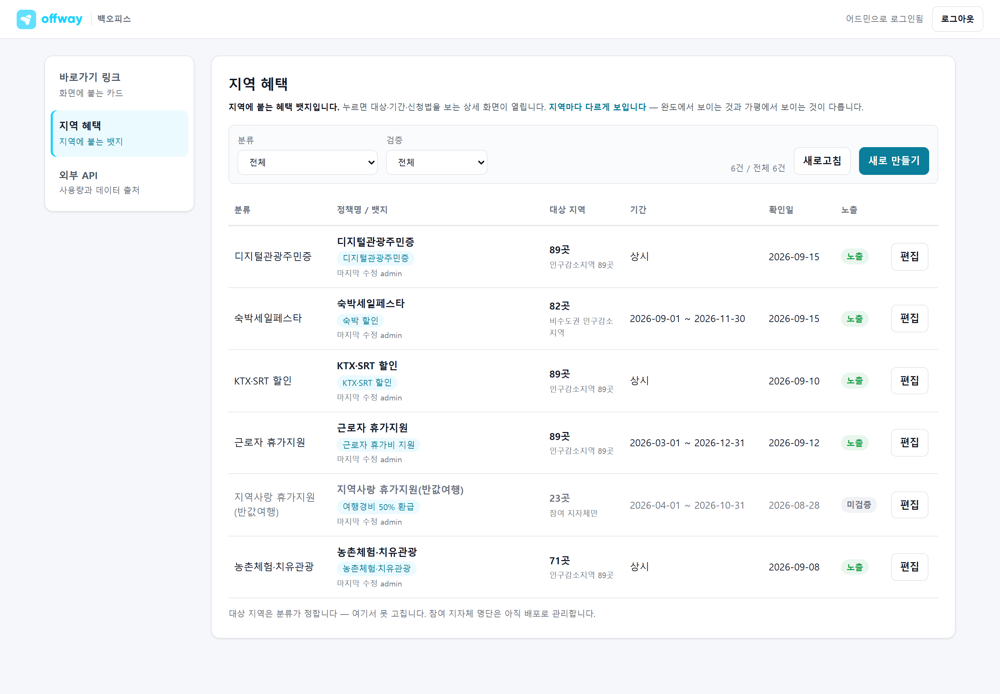

### 외부 API

연동마다 오늘 쓴 양과 일일 한도를 봅니다. **배치가 태웠는지 사용자 요청이 태웠는지**를 갈라서 보여주고, 어느 화면이 어떤 방식으로 쓰는지도 함께 답니다.

날짜별 막대에서 월배치가 도는 날이 튀는 것을 바로 찾을 수 있고, 배치는 여기서 멈추거나 즉시 돌립니다.

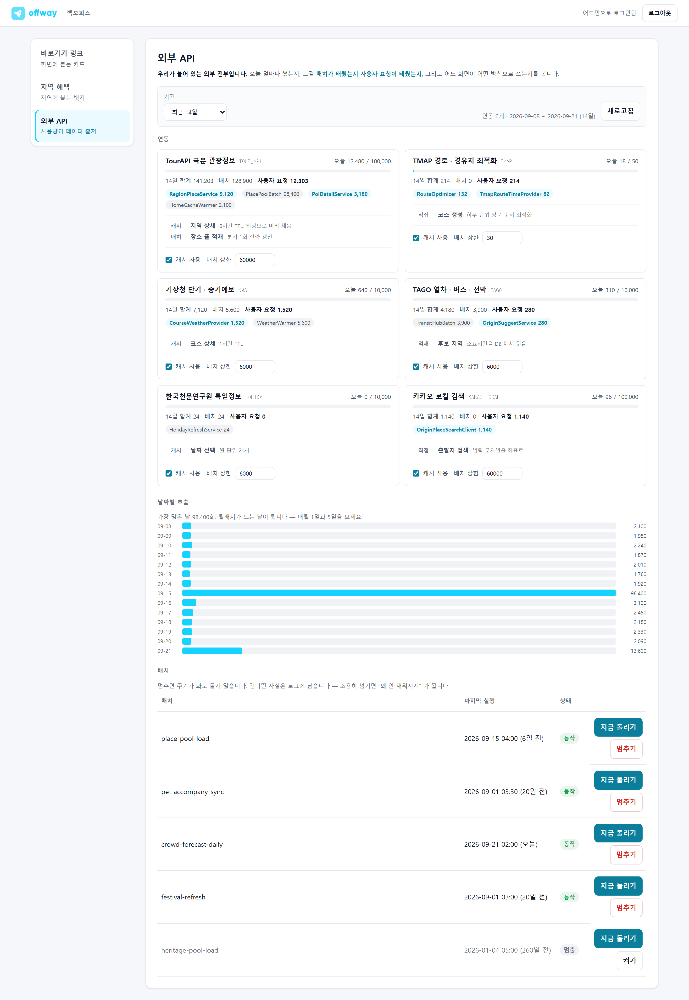

## 서비스 발전 계획

**여행자의 실제 경험을 지역에 전달합니다.**

여행이 끝난 뒤 좋았던 점과 아쉬웠던 점을 간단히 남길 수 있도록 합니다.

이런 기록이 쌓이면 방문자 수만으로는 알기 어려웠던, 여행자가 왜 방문했고 무엇에 만족했는지 확인할 수 있습니다.

**쌓인 피드백을 지역의 다음 관광 정책에 활용합니다.**

여행자 피드백을 지자체와 공유해 필요한 혜택을 보완하고, 축제·체험 프로그램 등 지역의 관광 일정에 맞춰 여행객을 연결하는 데 활용하고자 합니다.

**전국으로 확장합니다.**

최종적으로 OffWay 에서 완성한 코스 추천 엔진과 대중교통 연계 기술을 전국 시·군·구로 확장해 '나의 연차와 이동수단'에 맞춰 전국 어디든 떠날 수 있는 종합 여행 플랫폼으로 도약하고자 합니다.

## 팀 소개

<table>
  <thead>
    <tr>
      <th align="center" width="33%">Client</th>
      <th align="center" width="33%">Backend</th>
      <th align="center" width="33%">Design</th>
    </tr>
  </thead>
  <tbody>
    <tr>
      <td align="center"></td>
      <td align="center"></td>
      <td align="center"></td>
    </tr>
    <tr>
      <td align="center"><b>조영찬</b></td>
      <td align="center"><b>박세빈</b></td>
      <td align="center"><b>이예빈</b></td>
    </tr>
    <tr>
      <td align="center"><a href="https://github.com/ychany">@ychany</a></td>
      <td align="center"><a href="https://github.com/sevineleven">@sevineleven</a></td>
      <td align="center"><a href="https://www.behance.net/bad7ac99">Behance</a></td>
    </tr>
  </tbody>
</table>
